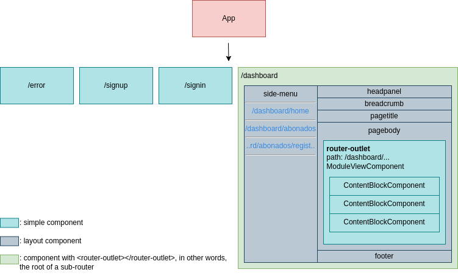

# Frontend

This SPA dashboard project was generated with [Angular CLI](https://github.com/angular/angular-cli) version 15.2.1.

## Development policies (**IMPORTANT TO FOLLOW**)

* File placement: Placement of files that serve a certain function should be placed in accordance with the [Folder structure](#folder-structure) explanation on folders.
* File naming (and other types of naming): This project generally follows the rules proposed by angular themselves [here](https://angular.io/guide/styleguide#naming), so **please** do give the guidelines a glance, there's reasons for why following a convention and keeping consistency does great work for the team, a few reasons described in the aforementioned document go like this:
    
    * **Naming conventions help provide a consistent way to find content at a glance. Consistency within the project is vital. Consistency with a team is important. Consistency across a company provides tremendous efficiency.**
    * **The naming conventions should help find desired code faster and make it easier to understand.**

    A notable rule that is often ignored would be [Separate file names with dots and dashes](https://angular.io/guide/styleguide#separate-file-names-with-dots-and-dashes). So **please** let's maintain consistency and keep our codebase healthy.
    Having said that there may be some room for exceptions or particular cases where I'd have deem worth doing differently, one example and hopefully the only one is the creation of **interfaces**, an interface file would usually be created as `user.interface.ts`, however for interfaces I prefer to add the prefix "I" before the name of the entity/model to easily identify in code what is an `Interface` and what is a `Class`, and name the files the same as the interface, resulting in `IUser.interface.ts` rather than `i-user.interface.ts` or `user.interface.ts`. This might be unnecessary but the result goes in line with the "**The naming conventions should help find desired code faster and make it easier to understand.**" point that was brought up.
* Naming convention for code: camelCase.
* The use of **Route Guards** and **Resolvers** is a must if a route contains any sort of data that is either fetched or passed on by some mean, such as a query url parameter, regular parameter, or from an API.
* **Route Guards** and **Resolvers** should be contained in their own scope, for example a **Guard** that is used globally in different components should be defined in `src/app/guards/`, while the ones that are used exclusively by a component should be defined within their own directory, let's say `src/app/components/card-viewer/` as an example.
* The last point does not only apply to **Guards** and **Resolvers**, interfaces, services, and such other files should follow the same rule.
* Pull requests are encouraged, and quality checking is a must. A codebase is a thing that extends as time goes on, let's keep it healthy.

## Key dependencies (prone to change or more likely to break your project)

### NPM dependencies
* jQuery v2.1.4.
* bootstrap.bundle.js v4.0.0 (IMPORTANT: bootstrap.css is v4.0.0-beta and it is defined inside shamcey.css!!!).

### Local dependencies `assets/lib`
* ionicons v2.0.0 (css and fonts).
* shamcey.css (contains bootstrap.css v4.0.0-beta and custom template style rules).

## NPM scripts

```bash
# run in development mode
$ npm run start

# run in production mode
$ npm run start:prod

# build (The build artifacts will be stored in dist/)
$ npm run build

# build as you develop
$ npm run watch

# test execute the unit tests via Karma
$ npm run test
```

---

## Project's layout



Let's explain in detail what we're seeing here, first of all we have our root App, this App has a routing module from which you get routes like `/error`, `/signup`, `/signin` and finally `/dashboard` which is a path in our `app-routing.module` that has children routes, under this route we encounter our layout components that makes up our view, the important ones are `side-menu` and `page-body`.

* `side-menu`: Holds the router links for our dashboard modules or user modules, these modules , such as registering a new user to our service, search for users and payment methods, and so forth.
* `pagebody`: Container that holds our `<router-outlet>` for our `dashboard.module`, it's the place where we show the content of our modules, and these modules contain something I call "content blocks", these content blocks ideally should be a dynamic component that returns the component that matches the type of content block the module defines.

    `ContentBlockComponent` doesn't exist but it is used as a placeholder name for components that should take the place as content, for example a `JsonFormComponent`, `ActionButtonsComponent`, `FilterFormComponent`, etc.

### Folder structure

Now that the project structure has been explained, let's see how that relates with the way we work in our folder structure:

```bash
AdminISP
├── docs
└── src
    ├── abstract-classes
    ├── app
    │   ├── core
    │   │   └── services
    │   ├── guards
    │   ├── pages
    │   │   ├── dashboard
    │   │   │   ├── components
    │   │   │   └── layout
    │   │   │       ├── breadcrumb
    │   │   │       ├── footer
    │   │   │       ├── headpanel
    │   │   │       ├── mainpanel
    │   │   │       ├── pagebody
    │   │   │       ├── pagetitle
    │   │   │       └── side-menu
    │   │   ├── error
    │   │   ├── signin
    │   │   └── signup
    │   ├── services
    │   └── shared
    ├── assets
    │   ├── css
    │   ├── img
    │   └── lib
    ├── utils
    ├── mock-data
    ├── environments
    └── shared-interfaces
```

> This folder structure may or may not be outdated. For accuracy please do check the current project's folders on this repository.

* `abstract-classes`: Folder where we define abstract classes that should help enforce business logic and policies/rules within components.
* `app/pages`: As the name suggests it holds the pages for our `app-routing.module` routes, inside of it we have our `dashboard` folder that in itself also has its own routing module.
* `dashboard/components`: There should be no need for an explanation but this is where we store our components used within the dashboard, and most importantly, the ModuleViewComponent in which our modules content lives (ModuleViewComponent is set as the component when defining routes for modules on app startup).
* `dashboard/layouts`: It's a folder whose purpose is to clean our templates and give more meaning through naming elements that makes up our application.
* `core`: Folder where singleton services are defined and used across all components.
* `shared`: Folder where shared components are defined, the difference from `layouts` is that `shared` should contain small-scale components, such like buttons, modals, form elements, etc...
* `shared-interfaces`: Global interfaces that don't necessarily represent a model/entity from the backend and are often used in different places.
* `assets/lib`: Is the place where dependencies that couldn't be found using package managers end up.
* `mock-data`: In cases when we're not getting any data from the backend just yet, we store files here that work as mock data to simulate responses, best case use is to define an async function that returns the mock data and in our application instead of fetching using http, we call the function to get the data asynchronously.
* `utils`: Commonly used functions or logic that takes up a lot of lines of code that would otherwise mess with the readability of a component are stored in this folder. Do **not** insert component state or service logic in the functions defined here, only rudimentary functions are allowed.

---

## Modules and routing

Modules refer to a section that make up our content, it is given to the client via a call to the backend and is tailored to each user. We use these modules to build our routing system, here's a basic route object that should be defined for each module that **possesses** content to display:
```typescript
{
    path: module.route,
    component: ModuleViewComponent,
    title: `Admin ISP - ${module.name}`,
    data: { module }, // pass the module (holds info about how to retrieve module data and what children or parent modules they have)
    resolve: { // resolver used to fetch data before switching routes
        contentBlocks: moduleViewResolver
    }
}
```
These route objects are defined in the `ConfigurationService` service, the resolver `moduleViewResolver` we use is in charge of fectching the content for a module when there is a change in the route, if the fetching fails then the route won't activate. Think of the `moduleViewResolver` as a guard or middleware that accepts or rejects the change of route, but that also fetches the data to show within it.

### DashboardModulesService

This service is responsible for storing the context of our application when traversing between modules within the dashboard, it stores data neccesary across components that display the current module's info. It stores as well the entirety of the user's modules (array of modules). This service is vital for the next topic we'll be covering "**Route based context**".

### Route based context

On dashboard startup and on route change within the dashboard (dashboard children routes), we subscribe to changes on the currently selected module `currentModule` in `DashboardModulesService`. `currentModule` should be updated inside resolver such as `moduleViewResolver` after a successful change of route and guards for routes that change the context.

### Exception handling and redirection

**VERY IMPORTANT**, There is a service under `core/services` called `error-handler.service.ts` that we'll be using a lot to handle different types of status codes that our backend can return. This service is what should be used whenever redirection is needed or any sort of error handling regarding data from the API.
> For example if a resolver doesn't manage to fetch the data it needs for the next route, we would use this service to redirect the user to a page that indicates the error that ocurred.

### Security

There is a service called `EncryptionService` which handles aspects of security throughout the application, one of those aspects is passing query parameters between routes in an encrypted manner. To do this the developer must be aware of the functions that handle these situations and use them accordingly. An example would look like this:
```typescript
// encryption (sending side)
const module = this.encryptionService.encryptRouteParameter(this.module);
this.router.navigate(['/dashboard/modules'], { queryParams: { module } });

// decryption (receiving side)
ngOnInit() {
    const ciphertext = this.route.snapshot.queryParamMap.get('module')!;
    let decryptedData = this.encryptionService.decryptRouteParameter<IModule>(ciphertext);
    this.modules = decryptedData.childrenModules;
}
```
> There is only a need for encryption for data that is sensitive or data that comes in the form of an Object or Array.